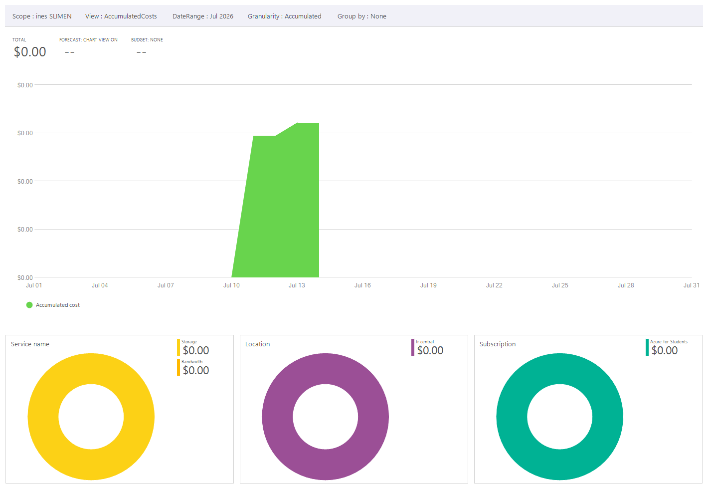

# Cost Management Basics

## Budgets, Cost Analysis, and Advisor – What’s the Difference?

| Feature           | Purpose                                                                                                            | Real‑world Use                                                                       |
|-------------------|--------------------------------------------------------------------------------------------------------------------|--------------------------------------------------------------------------------------|
| **Budgets**       | Set spending limits and trigger alerts when actual or forecasted spend exceeds thresholds.                         | “I want to be notified when my monthly costs reach 80% of $10 so I can investigate.” |
| **Cost Analysis** | Explore and visualise historical costs using various groupings (resource, service, tag, etc.) and export reports.  | “Which resource group drove the most spend last month?”                              |
| **Advisor**       | Provides personalised best‑practice recommendations for cost optimisation, security, reliability, and performance. | “Advisor suggests buying a Reserved Instance for my VM to save 50%.”                 |

## How They Work Together
1. Use **Cost Analysis** to understand your current and past spending patterns.
2. Create **Budgets** with alerts so you are proactively notified before overspending.
3. Apply **Advisor** recommendations to optimise resources and reduce future costs (e.g., resizing, reservations).

## Key Takeaways
- Budgets are forward‑looking; alerts are sent via Action Groups (email, SMS, etc.).
- Cost Analysis is historical; you can download CSV reports for further analysis.
- Advisor requires no configuration – it automatically scans your environment.
- Reservations and Savings Plans are long‑term commitments that lower compute costs.

## Overview
This project demonstrates the fundamentals of **Azure Cost Management**:  
- Creating budgets with alerts  
- Analyzing historical spend  
- Reviewing Advisor recommendations  

---

## Steps Completed
1. Created a **monthly budget** of $10 with an 80% alert threshold.  
2. Configured an **Action Group** to send email alerts at 80%.  
3. Viewed **Cost Analysis** by resource group and service name for the last 30 days.  
4. Reviewed **Advisor cost recommendations** for optimization.  
5. Exported a **daily cost report** to CSV.  

---

## Key Concepts
- **Budgets** → Spending limits with alerts to prevent overspending.  
- **Cost Analysis** → Historical spend visualization by resource group, service, or subscription.  
- **Advisor** → Provides optimization recommendations (e.g., reservations, savings plans).  
- **Reservations & Savings Plans** → Reduce compute costs by committing to usage.  

---

## Deliverables
- **budget.json** → Exported budget configuration.  
- **cost-analysis.png** → Screenshot of cost breakdown.  
- **README.md** → Documentation explaining budgets, cost analysis, and Advisor.  

---

## Lessons Learned
- Budgets help enforce **spending discipline**.  
- Cost Analysis provides **visibility into usage patterns**.  
- Advisor highlights **optimization opportunities**.  
- Combining budgets, analysis, and recommendations ensures **cost efficiency**.  

---

## Next Steps
- Automate budget creation with ARM/Bicep templates.  
- Schedule recurring exports of cost reports.  
- Implement **policies** to enforce tagging for cost tracking.

---

## Screenshots 

---

---
 
---
 
---
 
---
 
---
