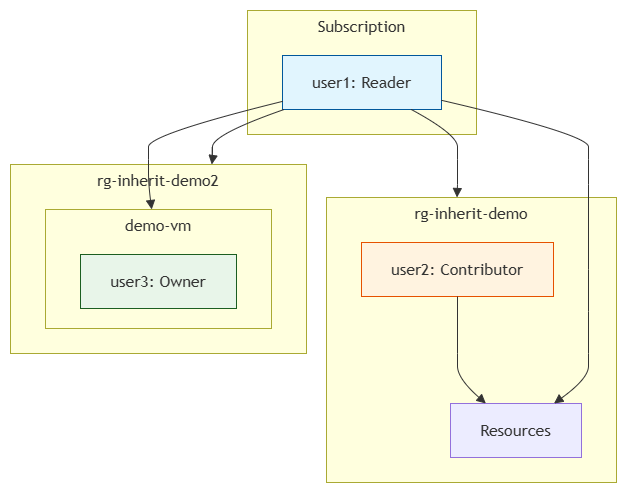

# RBAC Scope Inheritance

## Scope Hierarchy
Azure RBAC uses a hierarchy:  
**Management Group → Subscription → Resource Group → Resource**

- Permissions assigned at a higher level are **inherited** by all child scopes.  
- Permissions assigned at a lower level do **not** affect parents.  
- You can assign roles at any scope, giving you granular control.

## Principle of Least Privilege
By assigning roles at the narrowest possible scope, you minimize the impact of a compromised account. For example:
- `user1` only needs to monitor – give Reader at subscription.
- `user2` manages a development RG – Contributor at that RG.
- `user3` is a vendor who needs to fix a specific VM – Owner only on that VM.

## Deny Assignments
Deny assignments (created by Azure Policy or Blueprints) override role-based allow assignments. They are managed by administrators and are read‑only.

## Our Demonstration
- **Inheritance**: `user1` (Reader on subscription) automatically got Reader on all existing and new resource groups and their contents.
- **Scope containment**: `user2` (Contributor on `rg-inherit-demo`) could not access resources in `rg-inherit-demo2` after the VM move.
- **Resource‑level assignment**: `user3` (Owner on a single VM) could fully manage that VM but had no visibility outside it.

## Key Takeaway
Always assign roles at the **lowest scope** that meets the user’s job requirements. This practice limits exposure and aligns with zero‑trust security principles.

## Overview
This project demonstrates how **role assignments inherit down the scope hierarchy** in Azure RBAC.  
It shows how roles applied at higher scopes flow down to lower scopes, and how resource-specific assignments work.

---

## Steps Completed
1. Assigned Reader role to user1 at Subscription scope.  
2. Verified inheritance to RG and VM.  
3. Assigned Contributor role to user2 at RG scope.  
4. Moved VM to another RG → user2 lost access.  
5. Assigned Owner role to user3 at VM scope only.  
6. Verified user3’s limited access.  

---

## Key Concepts
- **Scope Hierarchy** → Management Group → Subscription → Resource Group → Resource.  
- **Inheritance** → Roles assigned at higher scopes automatically apply to lower scopes.  
- **Granularity** → Roles can be assigned at any scope, including individual resources.  
- **Deny Assignments** → Override allow assignments.  
- **Least Privilege Principle** → Assign only the minimum required role at the appropriate scope.  

---

## Deliverables
- **inheritance-diagram.png** → Diagram of scope hierarchy.  
- **test-cases.md** → Documented behavior at each scope.  
- **README.md** → Explanation of scope inheritance and least privilege.  

---

## Lessons Learned
- Subscription-level roles are powerful and broad.  
- RG-level roles are limited to that RG only.  
- Resource-level roles provide precise control.  
- Moving resources can change access if roles are scoped narrowly.  

---

## Next Steps
- Explore **deny assignments** for explicit restrictions.  
- Test **role inheritance** across management groups.  
- Combine RBAC with **Azure Policy** for governance.

## Inheritance Diagram

---
