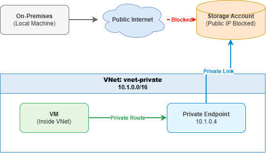

# Private Endpoint for Azure Storage

## Private Endpoint vs. Service Endpoint

| Feature | Service Endpoint | Private Endpoint |
|--------|------------------|------------------|
| **Network access** | Adds a route through the Azure backbone, but the storage still uses a public IP. | Assigns a private IP in your VNet; traffic never leaves the Azure fabric. |
| **DNS** | Uses the same public FQDN; no DNS changes. | Requires a private DNS zone to resolve the public FQDN to the private IP. |
| **Security** | Can restrict storage firewall to specific VNets/subnets. | Can completely disable public access, eliminating any internet exposure. |
| **Cross‑region access** | Works for VNets in any region. | Also works across regions (using global peering or hub‑spoke). |
| **Cost** | Free (except data processing). | Has hourly cost for the private endpoint and inbound/outbound data charges. |

## When to Use Private Endpoint
- **Maximizing security**: you need the storage to have no public endpoint at all.
- **Regulatory compliance**: data must never traverse the internet.
- **Hybrid connectivity**: accessing storage from on‑premises via ExpressRoute or VPN, you want the traffic to reach storage over a private IP.

## Our Implementation
- Created a storage account, blocked public access.
- Provisioned a private endpoint in the VNet for the blob service.
- Integrated with the `privatelink.blob.core.windows.net` private DNS zone.
- From a VM inside the VNet, the storage DNS resolved to the private IP, and HTTP connectivity succeeded.
- From outside (local machine), the DNS resolved to a public IP but all access was denied.

## Key Takeaway
Private endpoints provide the highest level of network isolation for Azure PaaS services. They are essential in enterprise environments where “public internet” must be fully excluded from the data path.

## Screenshots

---

---

---

---

---

---

---

## Lessons Learned
- Private endpoints enforce strict network isolation.  
- DNS integration is critical for resolution to private IPs.  
- Blocking public access ensures traffic flows only through private endpoint. 