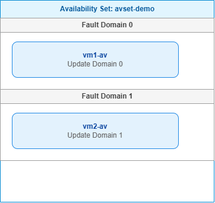

# Availability Sets

## What is an Availability Set?
An Availability Set is a logical grouping of VMs that ensures Azure distributes them across **fault domains** (isolated hardware racks) and **update domains** (groups for planned maintenance). This design improves availability by preventing a single point of failure.

## Fault Domains vs Update Domains
- **Fault Domain (FD)**: A physical grouping of servers that share a common power source and network switch. If a rack fails, only VMs in that fault domain are affected. Azure automatically spreads VMs across fault domains (max 3 per availability set).
- **Update Domain (UD)**: A logical grouping of VMs that can be updated (rebooted) at the same time during planned maintenance. The platform guarantees that only one update domain is rebooted at a time. You can have up to 20 update domains.

## Why Use Availability Sets?
- **Improved SLA**: 99.95% when two or more VMs are deployed in the same availability set, compared to 99.9% for a single VM.
- **Resilience**: Protects against hardware failures and unplanned downtime.
- **Planned Maintenance**: Updates are applied sequentially, so the application remains available.

## Limitations
- VMs must be created within the same **region** and **VNet**.
- You cannot add an existing VM to an availability set after creation; you must recreate the VM.
- Availability Sets work at the datacenter level; they do **not** protect against a region‑wide outage.
- Not all VM sizes are supported in availability sets (check `az vm list-skus` with `--zone` flag? Actually, availability sets are not zone‑aware; some sizes are restricted).

## Availability Sets vs Availability Zones
| Feature | Availability Set | Availability Zone |
|--------|------------------|-------------------|
| Protection scope | Single datacenter | Multiple datacenters within a region |
| Fault isolation | Physical rack/switch | Entire datacenter (zone) |
| Latency | Very low (same datacenter) | Slightly higher (inter‑zone) |
| SLA | 99.95% for 2+ VMs | 99.99% for 2+ VMs across zones |
| Use case | High availability within a datacenter | Disaster resilience within a region |

## Our Lab
- Created an availability set with 2 fault domains and 5 update domains.
- Deployed two VMs; verified they are in different fault domains.
- Documented the distribution and SLA.
- The diagram illustrates the logical separation.

## Screenshots 

---

---
 
---

---

## Lessons Learned
- Availability Sets protect against rack/power failures.  
- Update domains ensure rolling updates without full downtime.  
- Availability Zones provide stronger resilience (datacenter‑level).  