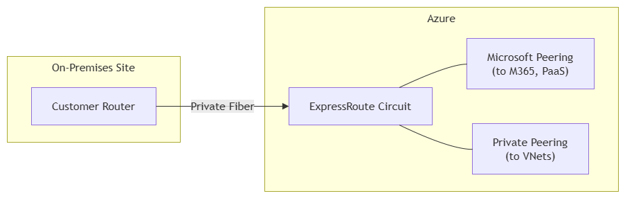

# Azure ExpressRoute – When and Why

## Overview
ExpressRoute provides a private, high‑bandwidth, low‑latency connection to Azure. It bypasses the public internet entirely, making it ideal for enterprise workloads with strict security or performance requirements.

## Decision Matrix
| Requirement | Recommended Solution |
|-------------|---------------------|
| Small office, quick setup, cost‑sensitive | VPN Gateway |
| <100 Mbps, internet is reliable | VPN Gateway |
| >1 Gbps sustained bandwidth | ExpressRoute |
| Compliance forbidding internet paths | ExpressRoute |
| Real‑time applications (voice, trading) | ExpressRoute |
| Connecting Microsoft 365 with guaranteed performance | ExpressRoute (Microsoft Peering) |
| Backup connectivity for ExpressRoute | VPN Gateway |

## Our Research
- Documented peering types: Private (VNets) and Microsoft (SaaS/PaaS).
- Compared ExpressRoute Local, Standard, and Premium SKUs.
- Created a detailed comparison with VPN Gateway.
- Designed an architecture diagram illustrating the private connection path.

## Additional Notes
- ExpressRoute circuits are billed monthly; even if no traffic flows, you pay for the circuit.
- Use **ExpressRoute Direct** for 10 Gbps or 100 Gbps ports directly from Microsoft, bypassing a partner.
- Combine with **Azure Virtual WAN** for large‑scale branch networking.

## References
- [Microsoft ExpressRoute documentation](https://docs.microsoft.com/azure/expressroute/)

## Architecture Diagram

---

---

---

## Lessons Learned
- ExpressRoute is ideal for compliance and enterprise workloads.  
- VPN Gateway is cost‑effective for smaller or less critical workloads.  
- Peering types define scope of connectivity.  