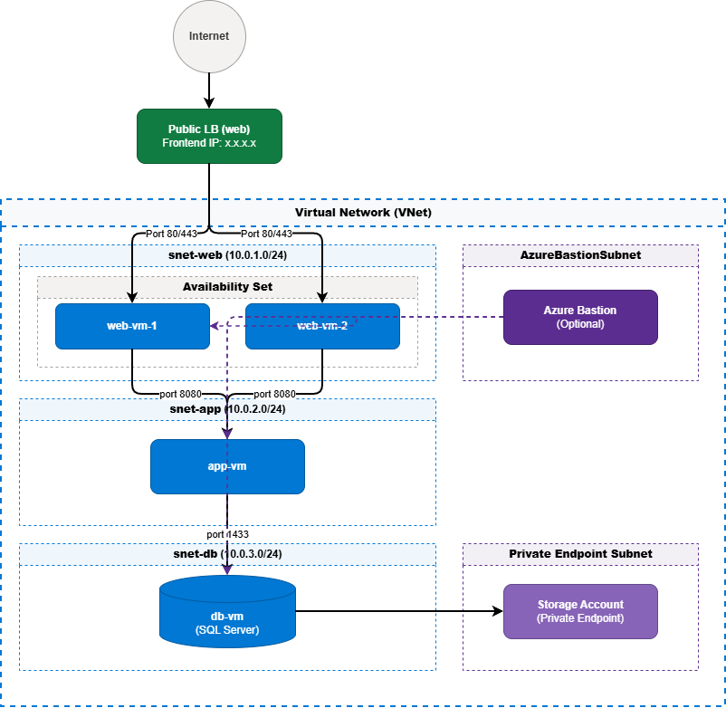

# Capstone: Three-Tier Secure Application

This deployment implements a production‑grade three‑tier architecture on Azure with security, backup, and monitoring.

## Architecture Layers
- **Web tier**: Two Windows VMs behind a public Load Balancer (HTTP/HTTPS).
- **Application tier**: One Linux VM accessible only from web tier on port 8080.
- **Database tier**: One Windows VM accessible only from app tier on port 1433.

## Security
- NSGs with least‑privilege rules per subnet.
- No public IPs on app/db VMs; management via Azure Bastion.
- Storage account logs accessible only via Private Endpoint.
- Azure Policy enforces `CostCenter` tag and allowed regions.
- RBAC: Dev team Contributor, Ops team Reader.

## Backup and Monitoring
- Daily backup of all VMs with 30‑day retention.
- Log Analytics workspace for diagnostics.
- CPU alert triggers when web VMs exceed 80% CPU.

## Deployment
```powershell
az deployment group create --resource-group rg-capstone --template-file main.bicep --parameters adminUsername=... adminPassword=...
```

# Then run post‑deployment scripts for LB backend, backup enablement, RBAC, and policy.

## Architecture Diagram

---

---

## Screenshots

---

---

---

---

## Lessons Learned
- Proper subnet isolation enforces security boundaries.
- RBAC and policy ensure governance and compliance.
- Monitoring and backup provide resilience and visibility.