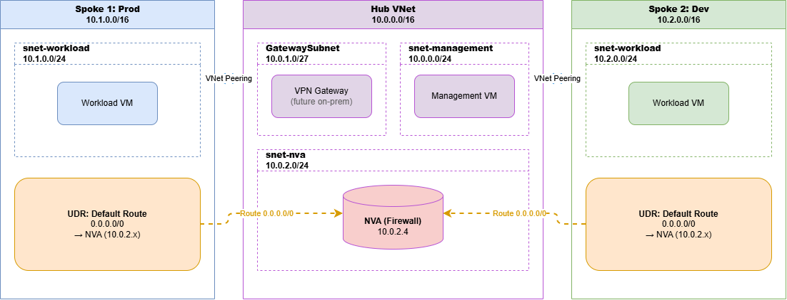

# Hub‑and‑Spoke Network Design

## Architecture
The hub‑and‑spoke topology centralises shared services in a **hub** VNet and isolates workloads in separate **spoke** VNets.

- **Hub VNet (10.0.0.0/16)**
  - `GatewaySubnet` – for VPN/ExpressRoute gateway (future on‑premises connectivity)
  - `snet-management` – for jumpboxes, monitoring, DNS
  - `snet-nva` – network virtual appliance (firewall/proxy)

- **Spoke 1 (10.1.0.0/16)** – Production environment
- **Spoke 2 (10.2.0.0/16)** – Development environment

All spokes are peered with the hub, but **not** with each other (peering is non‑transitive). The hub can share its VPN gateway with the spokes via **gateway transit**.

## Routing
- Each spoke contains a route table that forces all internet‑bound traffic (`0.0.0.0/0`) through the NVA in the hub.
- The NVA can be any firewall appliance, Azure Firewall, or a simple Linux VM with IP forwarding.
- This allows centralised inspection, logging, and policy enforcement for outbound traffic.

## Transitive Routing Workaround
- Spoke‑to‑spoke communication is not possible by default because VNet peering is non‑transitive.
- To enable spoke‑to‑spoke traffic, add routes in the spoke UDRs that point to the NVA for the remote spoke’s address space. The NVA must then forward packets between the spokes.

## Benefits
- **Centralised security**: All traffic flows through the hub for inspection.
- **Cost‑effective**: One set of shared services (DNS, AD, VPN) serves all environments.
- **Isolation**: Production and development workloads are completely separated.

## Deployment
All resources were deployed via Azure CLI. The VPN gateway provisioning can take up to 45 minutes; the rest of the network is functional without it.

## Toplogy Diagram

---

---

## Screenshots

---

---

---

---

---

---

---

---

---

---

---

---

---

---

---

## Lessons Learned
- Hub centralizes shared services and connectivity.  
- Spokes isolate workloads (production vs development).  
- UDRs and NVAs enforce traffic inspection.  